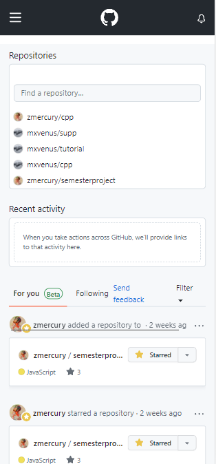
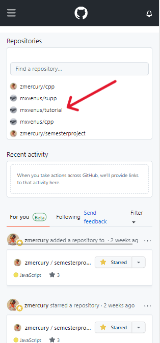
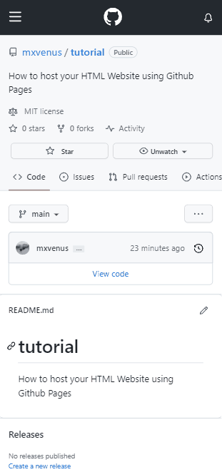
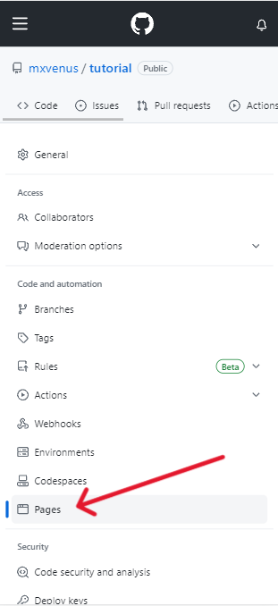
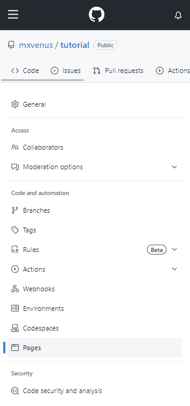
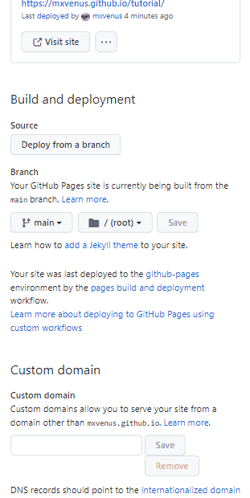
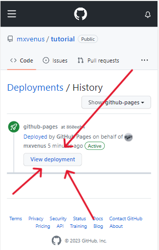
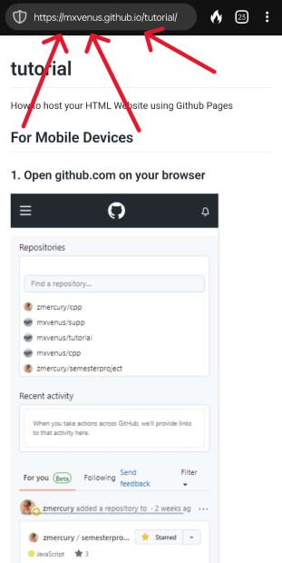

How to host your HTML Website using Github Pages

## For Mobile Devices

### 1. Open github.com on your browser

### 2. Click on your github project Repository

### 3. Drag along the scrollable menu and click on settings

### 4. Click on pages 

### 5. Scroll to the bottom and Select the main branch and click save

### 6. Scroll to the top and click on your Repository link and scroll to bottom and click on github-pages

### 7. Click on View Deployment Button

### 8. Copy the link and share... 

